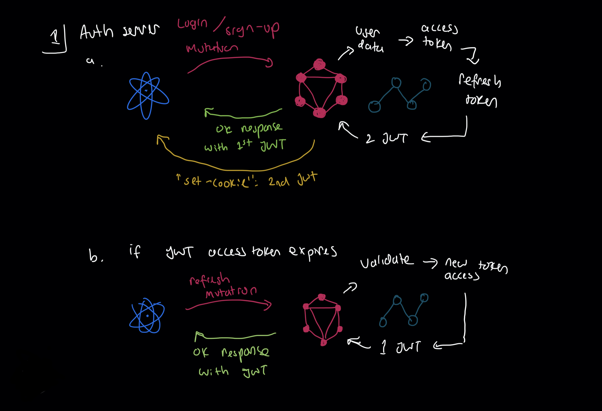
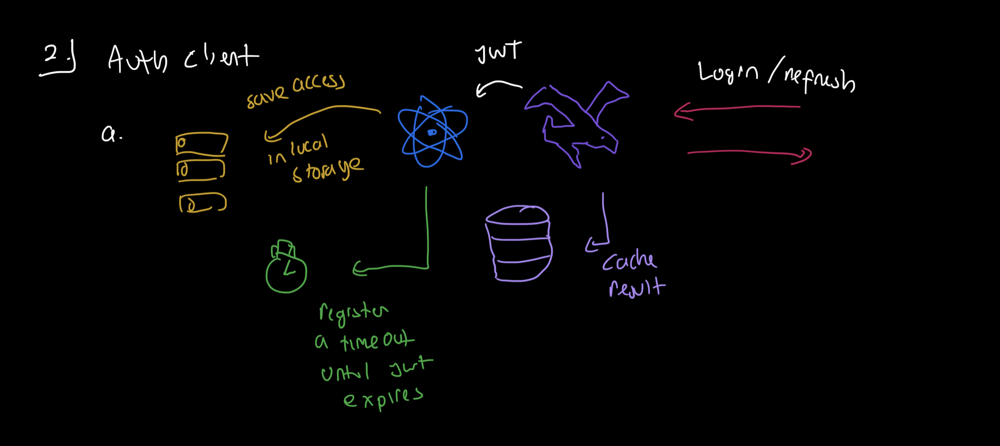
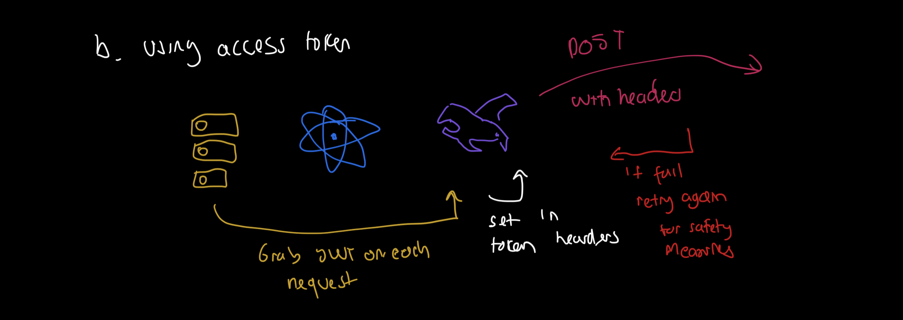
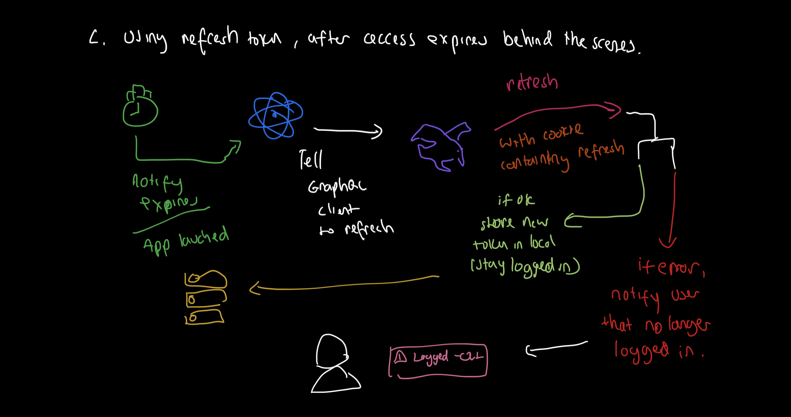
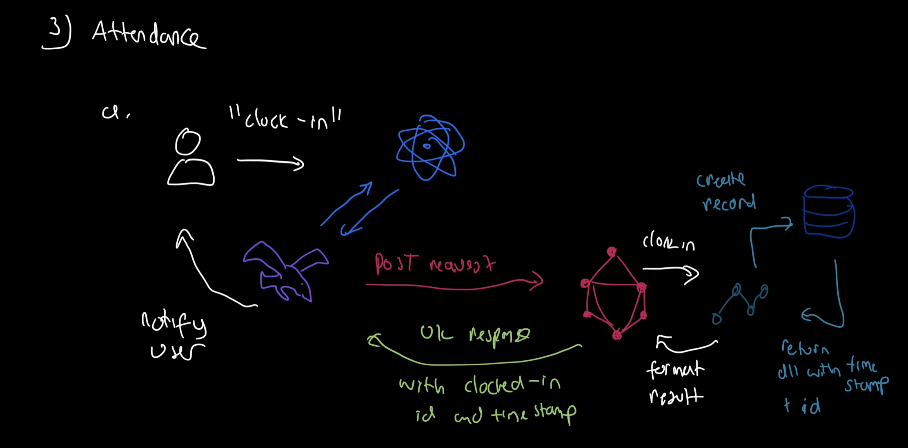
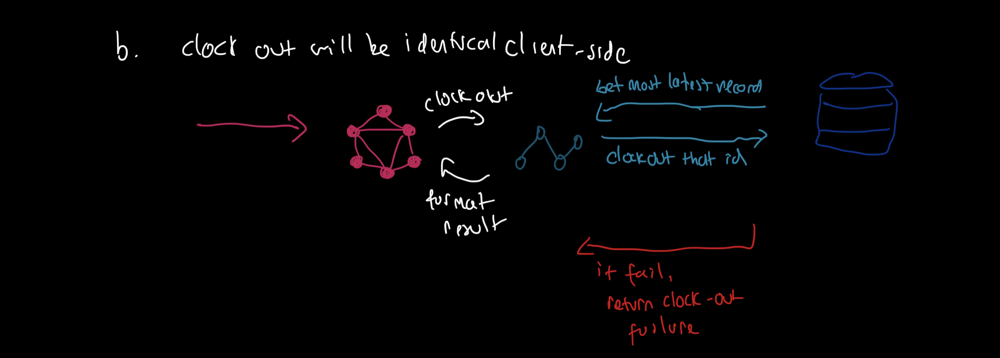
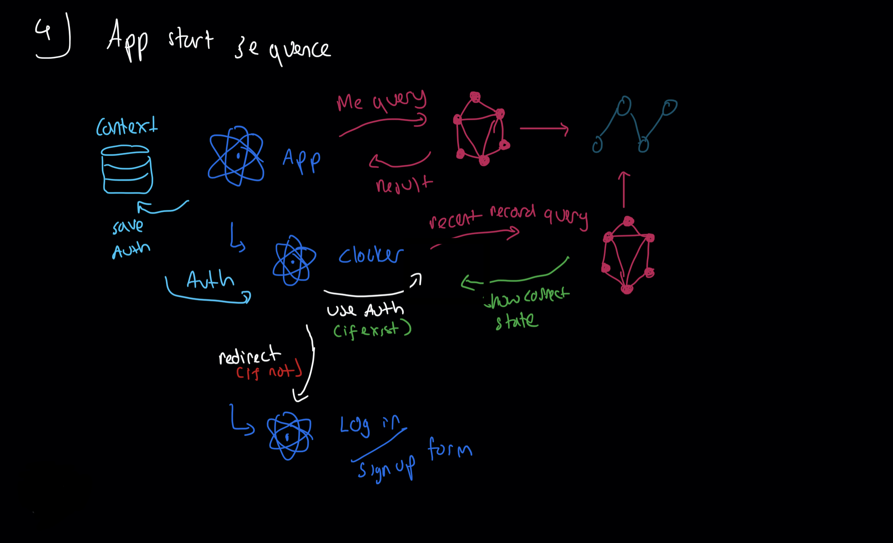

# Architecture overview

## Server

The server will be primarily be a GraphQL Server, this allow for a more defined control flow and flexible API for future changes, while mainting performance and efficiency on request.

The server is built in `Node` and `Typescript` as both will suffice for the task being done while not being over-engineered and takes too long to be developed.

Handling the GraphQL Request will be `Apollo Server` (v3), and `GraphQL Nexus` will be the code-first schema modelling tool.

The database of choice will be `Postgres` using along with `Prisma ORM` as it's easiest for me to use and provide all I need.

The idea is that the Server will specify a specific schema and allowed operation and the Client can take advantage of GraphQL to speed up the process of development.

| Name             | Usage                          | Reason                                                                     |
| ---------------- | ------------------------------ | -------------------------------------------------------------------------- |
| Node.js          | Server-side javascript runtime | Easy and scales well enough for the usage                                  |
| Typescript       | Language                       | A robust type system to make development easier, faster, and more reliable |
| Apollo Server v3 | GraphQL Middleware             | Allow to response to GraphQL request and follow all the required standards |
| GraphQL Nexus    | Schema and resolvers modelling | Allow for code-first type-safe schema and resolvers                        |
| Prisma           | Database Client                | Allow to communicate to a database efficiently and easily                  |
| Postgres         | SQL Database                   | Storing for structured information                                         |

## Client

The client will be built with `React` (SPA). It will be using `Tailwind` and `AtlasKit` to make the components. To connect to the GraphQL API, I will be using `React-Query` instead of `apollo-client`, because I thought it will be easier to use for something minimal which is what I am using (will be considering migrating to `apollo-client` when I need more features).

| Name     | Usage                           | Reason                                                           |
| -------- | ------------------------------- | ---------------------------------------------------------------- |
| React    | Single Page Application Library | Allow for builing Single page, interactive UI/UX with Javascript |
| Tailwind | CSS Utilities Library           | Allow for better and cleaner design                              |
| AtlasKit | Fully developeed components     | Allow for better UI without too much time                        |
| React-Query-Graphql     | Minimal HTTP Client          | Allow getting information to GraphQL Server                      |

## Server & Client response cycle

### Scenario 1: Authentication Server-side

#### `Login` / `Sign up`

A user will try to either log-in or sign-up through the React app. The React app will then make the appropriate GraphQL mutation to the server.

The server will handle fetching and confirming data inputs.

**If Successful**

The server will response the a `UserCredential` payload containing the user information and a the access token with its corresponding expiration date.

```graphql
"Wrapper for user with jwt"
type UserCredentials {
  expireAt: String!
  token: String!
  user: User!
}
```

```json
{
  "data": {
    "login": {
      "__typename": "UserCredentials",
      "user": {
        "id": "<uid>",
        "name": "<name>"
      },
      "token": "<access-token>",
      "expireAt": "<expiration-date>"
    }
  }
}
```

Along side the server will send a `set-cookie` header to change the client cookie jar to include the refresh-token which is used to refetch and avoid XSS and CSRF.

**If Failure**

The server will respond with an appropriate expected failure result or throw an error.
At this point, the client can either retry automatically or notify user before retrying.

---

#### `Refresh`

The access token is not persisted by the user at any type of storage to prevent any chance of XSS nor CSRF. Instead, the client will have a refresh token in their cookie jar to refetch the access token. This will prevent XSS as nothing is stored in a common place like localStorage and prevent CSRF as you can also perform refresh but can't read the resulting access token.

The process will be perform without too much hassle on the client side. If the expiration date was reach or that the app access token is empty, The client behind the scene (No user knowledge) will perform a GraphQL refresh mutation.

The server will read the refresh token from the cookie header and validate it.

```graphql
"""
Access token and friends without the user
"""
type AccessCredentials {
  expireAt: String!
  token: String!
}
```

```json
{
  "data": {
    "refresh": {
      "__typename": "AccessCredentials",
      "token": "<access-token>",
      "expireAt": "<expiration-date>"
    }
  }
}
```

**If Successful**

The server will respond similarly to the `Login/Signup` process with the correct user credentials.

**If Failure**

The server will throw an error and no token is sent

---



_<sub>Process diagram for login, sign up, and refreshing access token</sub>_

---

### Scenario 2: Authentication handling on the client-side

#### `Main access token after login / sign up / refresh.`

The server will give the access token from a GraphQL mutation. The GraphQL Client (Most likely urql) will then manage all the caches including invalidating the old values and save the new values. On the same time, the client will also save the access token in a local memory to be used for the next request. Beforehand, the client will also get the expiration date and calculate the time remaining, and create a timeout to do the refresh process.

```typescript
import { useMutation } from 'urql'
import { useCallback, useContext } from 'react'

const App: React.FC = () => {
  const {setAccessToken, refreshAccessToken} = useContext(AccessTokenContext);
  const [, loginMutation] = useMutation(LoginMutation);

  const registerRefresh = useCallback((expireAt: Date) => {
    const timeout = (expireAt.getTime() - Date.now()) * 1000;
    setTimeout(() => refreshAccessToken(), timeout);
  }, [refreshAccessToken]);

  const login = useCallback(async ({username, password}: Credential) => {
    const response = await loginMutation({ username, password })
    if (!response.data) return;
    switch (response.data.login.__typename) {
      case 'UserCredentials':
        const { token, expireAt } = response.data.login;
        setAccessToken(token, expireAt);
        registerRefresh(expireAt);
        // send toast to notify user
        break;
      case 'InvalidCredentials':
        const { password } = response.data.login;
        // send toast to notify user
        break;
      case 'UserNotFound':
        const { username } = response.data.login;
        // send toast to notify user
        break;
      default:
        // send toast to notify user
        break;
    }
  }, [setAccessToken]);

  return (
    <div>
      <button onClick={() => login()}>Login</button>
    </div>
  );
```

---



_<sub>Process diagram for this authentication</sub>_

---

#### `Using access token when available`

On the request process will be perform as usual which the GraphQL Client (urql) will grab the access token and set it in the authorization header. If the access token is expired, the client will automatically refresh the access token.

```typescript
import {
  createClient,
  dedupExchange,
  cacheExchange,
  fetchExchange,
} from "urql";
import { authExchange } from "@urql/exchange-auth";

const client = createClient({
  url: "/graphql",
  exchanges: [
    dedupExchange,
    cacheExchange,
    authExchange({
      /* config */
    }),
    fetchExchange,
  ],
});
```

**If Successful**

The request will be performed as usual

**If Failure**

The client will do a retry automatically, otherwise it will show an error message to the user in a pop up toast. The client will give the option to also clear the access token from the local memory and trigger a refresh.

---


_<sub>Process diagram for making authenticated request</sub>_

---

#### `Refreshing token`

Given any of the scenario where the access token is expired, the access token is invalid, or the app has recently started, the client will perform a GraphQL mutation to refresh the access token. This action is done without the user knowledge.

**If Successful**

The user state will be set to `Logged in` and will be allowed to access other part of the application. The client will also save the new access token in the local memory.

**If Failure**

The user state will be set to `Logged out` and will be redirected to the login page.

---



_<sub>Process diagram for refreshing access token</sub>_

---

### Scenario 3: Clock in / Clock out

#### `Clock in`

Clock in will begin with user perfoming the act in the UI. The client will then perform a GraphQL mutation to the server. The server will create a new attendance record and return the new attendance record.

**If Successful**

The server will give the new record information and set the client state to `Clocked in` so the user can clock out.

**If Failure**

The client will notify the user and ask for retry.

---



_<sub>Process diagram for clocking in</sub>_

---

#### `Clock out`

The client side perpective is identical. It's yet to be decided if the client need to will fetch the state first or the serve handle this automatically

---



---

### Scenario 4: App start sequence

In the app start, the main App component will try to check if user is logged. Obviously there will likely no access token in the local memory. If the access token doesn't exist, the server will automatically try to refresh the access token.

**If Successful**

If the client receives the access token, the user state will be set to `Logged in` and the client will be allowed to access other part of the application. The client will also fetch the state of the user from the server.

**If Failure**

The client will set the user state to `Logged out` and will redirect to the login page.

---



---
